<div align="center">

# AEGIS

### AI 기반 공항 Bird-Strike 예방·대응 시스템

**4-Camera Multi-Baseline 3D Vision · Bird AI · Tracking · Decision Support · Dual Pan-Tilt**


**2026 임베디드SW경진대회 자유공모 부문**

[빠른 실행](START_HERE_KO.md) · [시스템 구조](docs/ARCHITECTURE.md) · [기구·CAD](docs/HARDWARE_AND_CAD.md) · [카메라 보정](docs/CAMERA_CALIBRATION.md) · [터렛 보정](docs/TURRET_CALIBRATION.md) · [AI 파이프라인](docs/AI_PIPELINE.md) · [AI 정량결과](docs/AI_RESULTS.md) · [정량 표기원칙](docs/METRICS.md) · [팀 역할](TEAM.md)

<br>

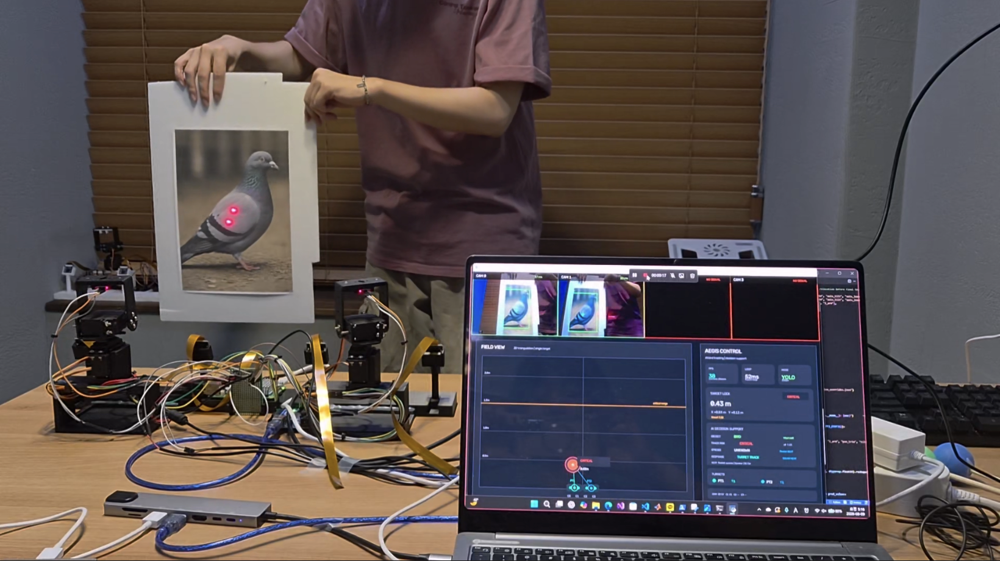

</div>

---

## 1. 프로젝트 한눈에 보기

공항의 Bird-Strike 대응은 단순히 새를 검출하는 것만으로 끝나지 않는다. **어떤 조류가 어디에 있고, 어느 방향으로 이동하며, 현재 얼마나 위험한지 판단한 뒤 물리 대응 장치까지 연결**해야 한다.

AEGIS는 다음 전체 흐름을 하나의 Embedded AI 시스템으로 구현한다.

> **Problem → Perception → Localization → Tracking → Decision → Response**

| 단계 | 구현 내용 |
|---|---|
| Perception | YOLO 기반 조류 검출 + ResNet-18 8개 조류군 분류 |
| Localization | 4대 카메라, 6개 Stereo Pair, 0.15 / 0.30 / 0.45 m Multi-Baseline 3D |
| Tracking | LPF · Kalman · velocity estimation · track hold |
| Decision | 조류군 · XYZ · 상대고도 · 접근 상태 · track evidence 기반 설명 가능한 위험도 |
| Response | Dual Pan-Tilt turret + Acoustic/RC-Car 확장 구조 |

---

## 2. 전체 시스템 구조

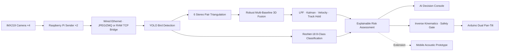

### 핵심 차별점

- **4-Camera / 6 Stereo Pair**를 모두 보정하는 Multi-Baseline 구조
- 조류 위치 검출과 조류군 분류를 분리한 **2-stage AI pipeline**
- 단발성 detection이 아닌 **시계열 tracking · velocity · hold**
- 3D 좌표를 실제 터렛 각도로 변환하는 **기구학 모델 + 실측 보정 파이프라인**
- Species · XYZ · Motion · Risk · Recommended Response를 통합한 **AI Decision Console**
- 고정형 터렛과 이동형 음향 플랫폼이 같은 response layer를 공유하는 확장 구조

---

## 3. 기술 영역별 구현

| 영역 | 핵심 구현 | 상세 문서 |
|---|---|---|
| 기구·CAD | A/B 감시 시나리오, 카메라·터렛 거치대, baseline 실측 | [HARDWARE_AND_CAD.md](docs/HARDWARE_AND_CAD.md) |
| Camera Calibration | 4 intrinsics, 6 stereo-pair, 품질 게이트, runtime 좌표 재스케일 | [CAMERA_CALIBRATION.md](docs/CAMERA_CALIBRATION.md) |
| 3D Tracking | triangulation, multi-pair weighting, LPF/Kalman, velocity, hold | [ARCHITECTURE.md](docs/ARCHITECTURE.md) |
| Turret Control | inverse kinematics, laser offset, trim, axis tilt/lean, 22-point calibration | [TURRET_CALIBRATION.md](docs/TURRET_CALIBRATION.md) |
| AI·Dataset | class-wise curation, YOLO, ResNet-18, confidence gate, temporal voting | [AI_PIPELINE.md](docs/AI_PIPELINE.md) |
| AI Results | training curve, P/R/F1 curve, confusion matrix, class별 지표, Risk weight | [AI_RESULTS.md](docs/AI_RESULTS.md) |
| Communication | 2-RPi / 4CH packet, latest-first transport, ZMQ/Serial interface | [PROTOCOLS.md](docs/PROTOCOLS.md) |
| Validation | 통신·기하·제어·AI 계층별 장애 분석과 검증 | [VALIDATION_AND_ROBUSTNESS.md](docs/VALIDATION_AND_ROBUSTNESS.md) |

---

## 4. 기구·CAD 및 감시영역

AEGIS는 한 가지 기구 배치만 제시하지 않고 운용 환경을 기준으로 두 가지 감시 개념을 구성했다.

- **A안:** 활주로·지평선·저지대 접근 관측
- **B안:** 상부 영공·높은 접근 경로 관측

설계 문서의 mechanical reference:

| 항목 | 기준 치수 |
|---|---:|
| 전체 조립 reference | 약 320.7 × 314.7 × 99.1 mm |
| 기판 / 베이스 | 약 60 × 580 × 15 mm |
| 20° 카메라 거치대 | 약 28 × 17.1 × 76.4 mm |
| 터렛 거치대 | 약 119.6 × 111.7 × 99.1 mm |
| 인접 카메라 간격 | 149 / 151 / 149 mm |
| outer baseline | 약 449 mm |

<p align="center">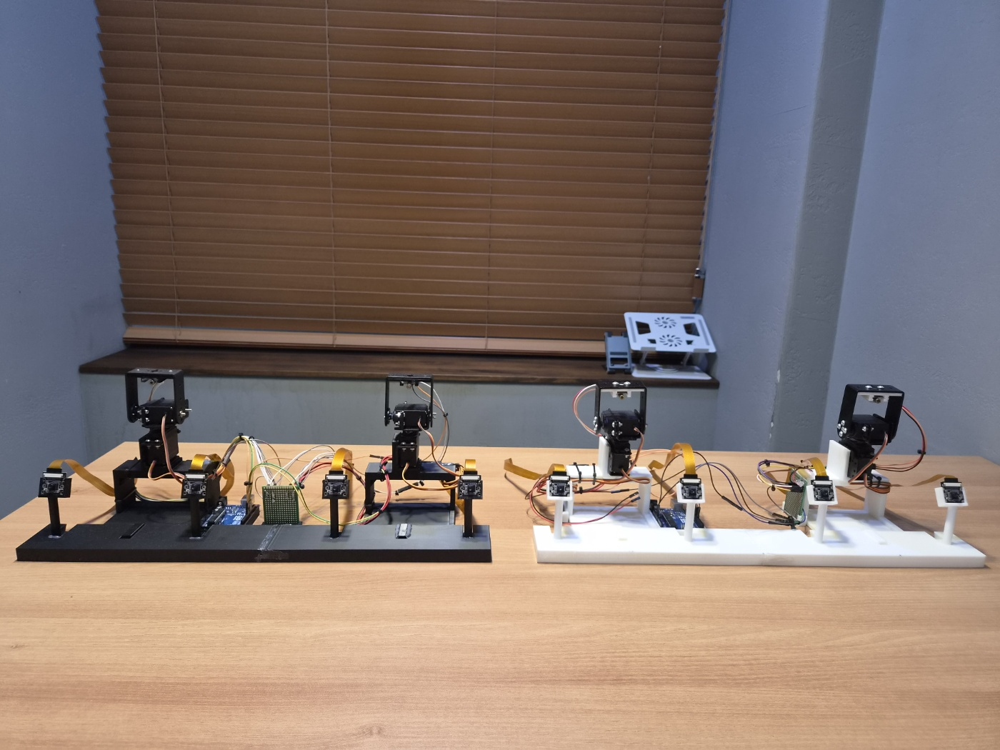</p>

---

## 5. 카메라 캘리브레이션과 Multi-Baseline 3D

- Checkerboard square: **25.0 mm**
- Single calibration: camera 0–3 내부 파라미터
- Stereo calibration: `01`, `02`, `03`, `12`, `13`, `23`
- Calibration profile: **1280×720 · 20 FPS · JPEG Q76**
- Runtime profile: **640×360 · 30 FPS · JPEG Q70**
- 2D detection은 calibration 좌표계로 재스케일한 뒤 triangulation에 사용
- 인접 pair `01/12/23`은 4개 카메라 좌표계를 연결하는 최소 체인, 나머지 pair는 추가 강건성과 깊이 정밀도를 제공

| 평가 항목 | 결과 |
|---|---:|
| Single-camera RMS | **0.154–0.181 px** |
| Six stereo-pair RMS | **0.217–0.289 px** |
| Depth sensitivity P95 — 0.15 m | **95.3 mm** |
| Depth sensitivity P95 — 0.30 m | **49.2 mm** |
| Depth sensitivity P95 — 0.45 m | **33.1 mm** |
| 0.45 m vs 0.15 m sensitivity improvement | **65.3%** |

<p align="center">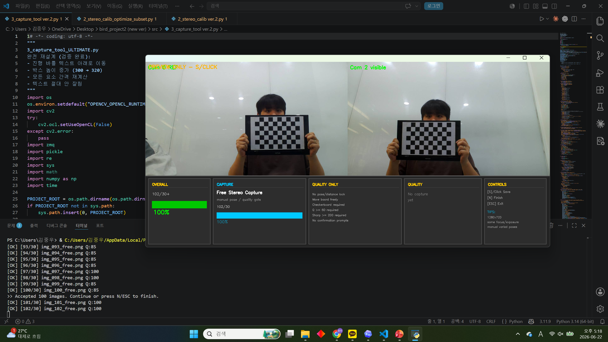</p>

---

## 6. 터렛 기구학 및 실측 보정

AEGIS는 단순히 화면 중심을 서보 각도로 비례 변환하지 않는다. 카메라가 산출한 3D target을 터렛 좌표계로 옮긴 뒤, 실제 기구의 피벗 높이·암 길이·레이저 오프셋·설치 기울기를 반영한다.

```text
pan  = 90° − atan2(x_rel − dx_laser, z_rel − dz_laser) + pan_trim

tilt = 90° + atan2(y_rel, dist_h)
       − asin(l_arm / dist_PT)
       + tilt_trim
```

`axis_tilt`와 `axis_lean`은 pan 방향에 따른 설치 기울기 잔차를 흡수한다. `calib_data.json`에는 **PT1·PT2 각각 22개 실측 3D target–servo angle sample**이 보존되어 있으며, `calibration_turret.py`가 geometry·trim·axis correction과 depth scale을 최적화해 `turret_calibration_overrides.json`으로 저장한다.

현재 Runtime override의 주요 값:

| Parameter | PT1 | PT2 |
|---|---:|---:|
| `pos_global` | `[0.0758, 0, -0.0869]` m | `[0.3755, 0, -0.0918]` m |
| `h_pivot` | 0.1280 m | 0.1280 m |
| `l_arm` | 0.0410 m | 0.0410 m |
| `dz_laser` | 0.012 m | 0.012 m |
| `pan_trim` | +4.0° | +3.0° |
| `tilt_trim` | −5.8° | −1.6° |
| `axis_tilt` | −0.81° | +0.21° |
| `axis_lean` | +0.40° | −5.80° |

전체 depth correction은 `z_scale = 0.7611`로 저장된다. 기구를 이동하거나 카메라 baseline을 변경하면 이 값들을 그대로 재사용하지 않고 재측정해야 한다.

> 설계 발표자료의 초기 mechanical reference에는 `dx_laser = 0.002 m`가 기록되어 있으나, 현재 보존된 Runtime override는 재측정 후 `0.000 m`를 사용한다. 재현 시에는 GitHub의 override JSON을 현재 하드웨어 기준값으로 본다.

---

## 7. AI·데이터셋·위험 판단

### Dataset Curation

- 원천 아카이브: **약 13 GB · 156,416 files · 33 folders · 약 40K candidate images**
- class-wise 유효 paired source: **13,170 images**
- Raspberry Pi 실환경 background/negative: **518 images**
- final prepared YOLO v2: **12,819 images**
- YOLO held-out test: **1,325 images / 1,436 bird instances / 67 backgrounds**
- ResNet final test: **1,375 crops**

<p align="center">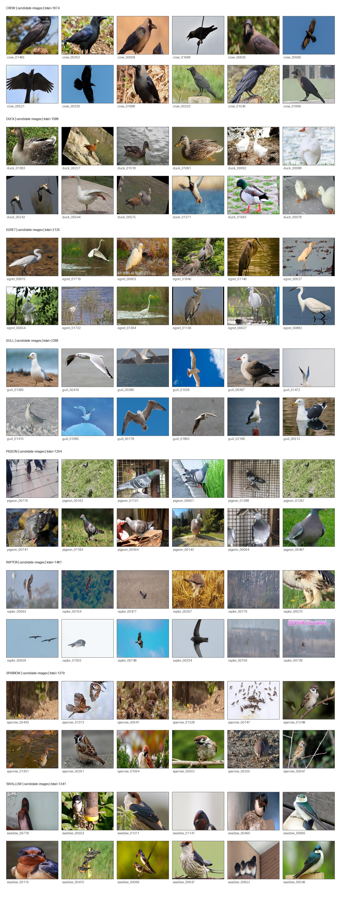</p>

### 2-Stage AI

```text
YOLO bird bbox / center
→ crop quality gate
→ ResNet-18 8-class classification
→ Top-1 confidence + Top1–Top2 margin
→ 5-of-7 temporal voting
→ Explainable Risk Assessment
```

Classes/groups:

```text
crow · duck · egret · gull · pigeon · raptor · sparrow · swallow
```

`raptor`는 단일 생물학적 종이 아니므로 본 문서에서는 **8-class bird classification / 8개 조류군 분류**라고 표현한다.

### Aggregate Metrics

| Model | Metric | Result |
|---|---|---:|
| Custom YOLOv8s | Precision / Recall | **96.4% / 93.5%** |
| Custom YOLOv8s | mAP@0.5 | **97.5%** |
| Custom YOLOv8s | mAP@0.5:0.95 | **70.9%** |
| ResNet-18 | Test Accuracy | **94.76%** |
| ResNet-18 | Test Macro-F1 | **94.56%** |
| ResNet-18 | Best Val Accuracy / Macro-F1 | **95.52% / 95.20%** |

Custom YOLO 수치는 **Held-Out Offline Test**이며 live field accuracy가 아니다. 현장 domain shift를 고려해 현재 안정 Runtime은 YOLO26n bird detection과 ResNet-18 classification을 결합한다.

### AI Quantitative Evidence

| Custom YOLO Final Training Curves | ResNet-18 Final Confusion Matrix |
|---|---|
| 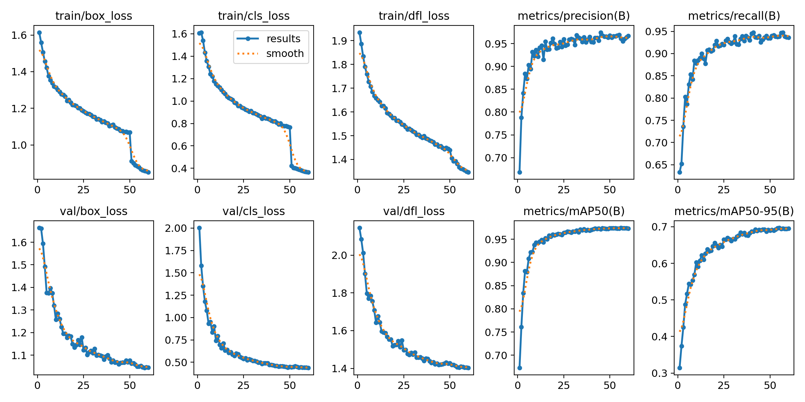 | 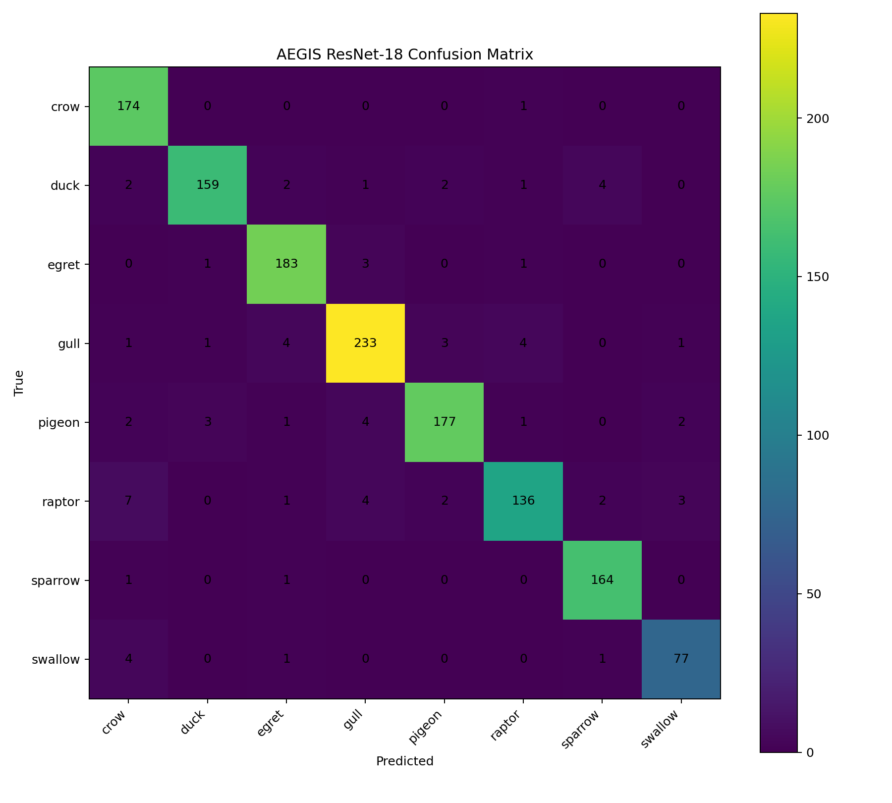 |

| YOLO Normalized Confusion Matrix | YOLO F1–Confidence Curve |
|---|---|
| 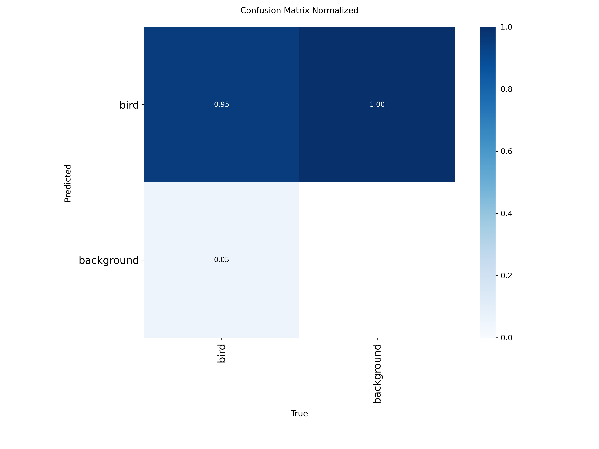 | 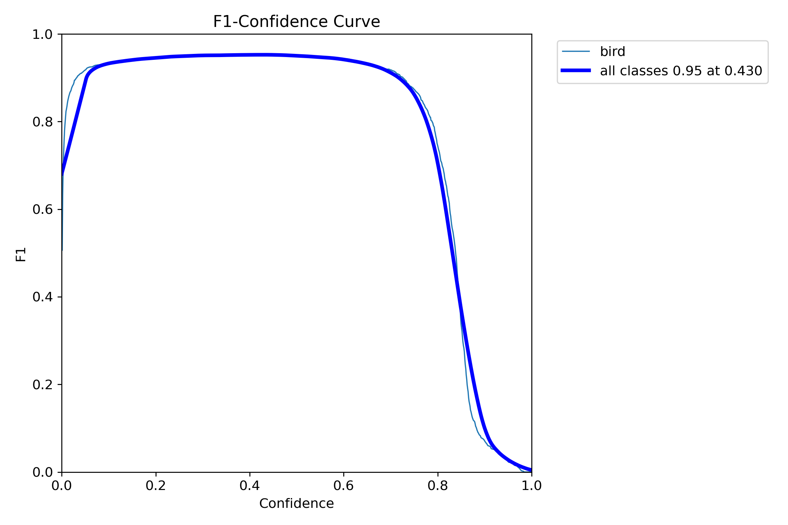 |

### ResNet Class-level Highlights

| Class / Group | Precision | Recall | F1-score |
|---|---:|---:|---:|
| crow | 91.10% | 99.43% | 95.08% |
| egret | 94.82% | 97.34% | 96.06% |
| raptor | 94.44% | 87.74% | 90.97% |
| sparrow | 95.91% | 98.80% | 97.33% |
| **Macro average** | **94.66%** | **94.57%** | **94.56%** |

8개 전체 class의 Precision·Recall·F1·support와 P/R/F1 confidence curve는 [AI_RESULTS.md](docs/AI_RESULTS.md)에 정리되어 있다.

---

## 8. AI Decision Console & Response

AI Console은 live bird crop과 함께 다음을 표시한다.

- species/group prediction, confidence, Top1–Top2 margin, stable vote
- X / Y / Z, forward range, relative altitude signal
- approaching / crossing / leaving motion state
- Risk Score 0–100, Risk Level, Recommended Response

| Pigeon Result | Crow Result |
|---|---|
| 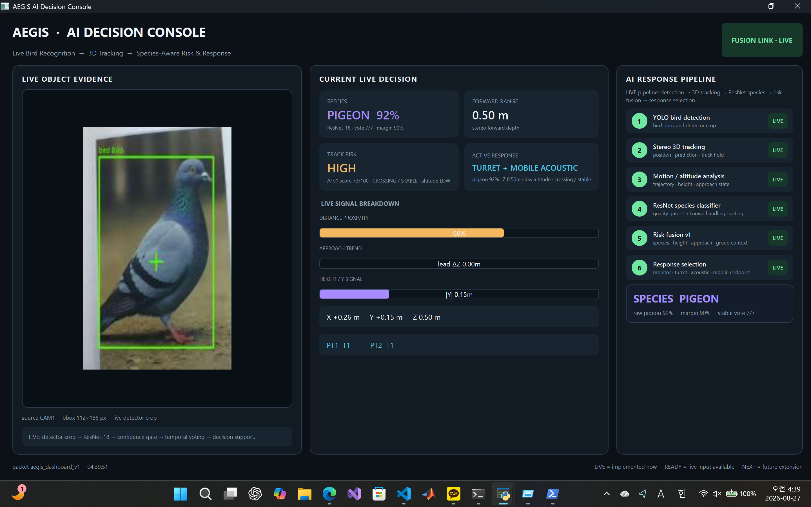 | 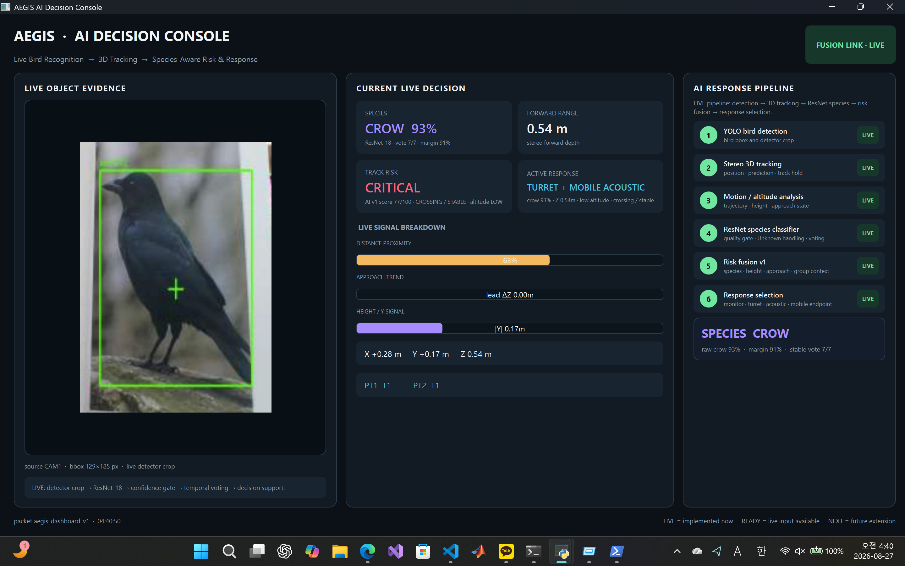 |

현재 Decision Engine은 별도의 neural network가 아니라 **설명 가능한 operational rule set**이다. 실제 구현은 distance, approach, relative altitude, species priority, track state, Fusion threat evidence를 가중 결합한다.

| Factor | Weight |
|---|---:|
| DistanceRisk | 30 |
| ApproachState | 20 |
| RelativeAltitude | 10 |
| SpeciesPriority | 15 |
| TrackState | 10 |
| FusionThreat | 15 |

결과는 공항 인증 자동 명령이 아니라 prototype 단계의 recommended response다.

---

## 9. 계층별 장애 분석과 강건성

| 문제 | 원인 | 대응 |
|---|---|---|
| 프레임 지연 | 비동기 큐 누적·송신기 시간차 | 유선 Ethernet, low HWM, latest-first, corrected timestamp, sync window |
| 3D 좌표 튐 | calibration·pair 품질 편차 | 고해상도 single/stereo 보정, pair 품질 게이트, runtime 좌표 재스케일 |
| 터렛 조준 오차 | 설치 기울기·레이저 offset | pan/tilt trim, axis_tilt/lean, 실측 target 기반 최적화 |
| 검출 불안정 | 작은 bbox·배경·라벨 오염 | HSV baseline, hard negative, class-wise audit, Unknown gate |

핵심은 한 번에 모든 오차를 보정하지 않고 **통신 → 기하 → 추적 → 제어 → AI** 계층별로 원인을 분리한 것이다.

---

## 10. 저장소 구조

```text
AEGIS/
├─ runtime/
│  ├─ fusion_pc/          # Fusion · AI Console · Risk · Turret runtime
│  └─ raspberry_pi/       # IMX219 sender · 4CH transport
├─ firmware/              # Arduino Dual Pan-Tilt firmware
├─ training/              # 데이터 정제 · YOLO · ResNet 학습 코드
├─ models/                # Runtime / research weights — Git LFS
├─ calibration/           # 4 intrinsics + 6 stereo-pair NPZ
├─ results/               # 최종 YOLO · ResNet 정량 결과
├─ assets/                # 시스템 · CAD · calibration · dataset · console 이미지
├─ docs/                  # 세부 설계·보정·통신·AI·검증 문서
├─ scripts/               # 최소 실행 스크립트
├─ START_HERE_KO.md
└─ TEAM.md
```

---

## 11. 빠른 실행

```powershell
git lfs install
git lfs pull
cd runtime\fusion_pc
py -3.11 -m venv .venv
.\.venv\Scripts\Activate.ps1
pip install -r requirements.txt
powershell -ExecutionPolicy Bypass -File .\demo_preflight.ps1
```

실행 순서:

```powershell
py -3.11 .\tcp_zmq_bridge.py
py -3.11 .\5_final_fusion.py
py -3.11 .\ai_decision_dashboard.py
py -3.11 .\6_turret_server.py
```

Raspberry Pi:

```bash
./scripts/rpi_start_sender.sh <FUSION_PC_IP>
```

방화벽·IPv4·Arduino COM·모델 점검은 [RUNBOOK.md](docs/RUNBOOK.md)를 따른다.

---

## 12. 팀 역할

| 구성원 | 담당 Domain | 핵심 책임 |
|---|---|---|
| **김중우** | **SYSTEM · 3D VISION · CONTROL** | CAD·기구·4CH 입력·통신·Single/Stereo calibration·triangulation·multi-pair fusion·tracking·turret·통합 환경 |
| **박주은** | **AI · DATASET · DECISION** | 데이터 수집·정제·YOLO·ResNet·quality gate·temporal voting·risk/response·AI Console 검증·정량 evidence·GitHub release |
| **공동 수행** | **INTEGRATION · EVALUATION** | 통합 시험·정량 검증·시나리오 반복·오류 분석·최종 보고서·시연 영상·발표 준비 |

역할별 세부 책임은 [TEAM.md](TEAM.md)에 정리했다.

---

## 13. 한계와 향후 확장

- 공항·야외 hard-negative mining 및 field fine-tuning
- 장거리·저조도·우천 환경 검증
- 외부 기준좌표를 이용한 절대고도·world coordinate 연동
- 조류학·공항운영 데이터 기반 species-risk weight 고도화
- 다중 고정형·이동형 endpoint를 연결하는 distributed response architecture
- 풍력발전·농가·국방 경계·무인 방호 시스템으로 확장

> AEGIS는 하나의 큰 기계가 아니라, **인지–3D 위치추정–추적–판단–대응을 연결하는 범용 Embedded AI architecture**를 목표로 한다.
