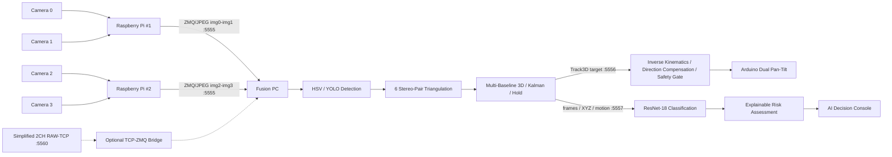
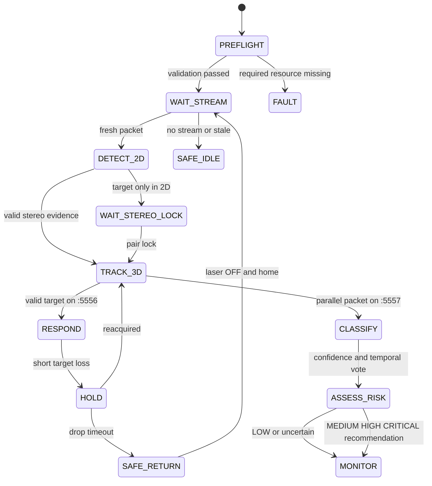

<div align="center">

# AEGIS

### AI 기반 공항 Bird-Strike 예방·대응 시스템

**2-Raspberry Pi · 4-Camera Multi-Baseline 3D Vision · Bird AI · Tracking · Decision Support · Dual Pan-Tilt**


**2026 임베디드SW경진대회 자유공모 부문**

[빠른 실행](START_HERE_KO.md) · [Runtime Modes](docs/RUNTIME_MODES.md) · [시스템 구조](docs/ARCHITECTURE.md) · [운용 상태](docs/OPERATION_FLOW.md) · [파일 구조](docs/REPOSITORY_STRUCTURE.md) · [카메라 보정](docs/CAMERA_CALIBRATION.md) · [터렛 보정](docs/TURRET_CALIBRATION.md) · [AI 정량결과](docs/AI_RESULTS.md) · [팀 역할](TEAM.md)

<br>


</div>

---

## 1. 개발 배경과 목표

공항의 Bird-Strike 대응은 단순히 새를 검출하는 것만으로 끝나지 않는다. **조류의 3D 위치와 이동을 안정적으로 추적해 물리 대응 장치가 따라가게 하고, 동시에 조류군과 위험도를 운용자에게 설명**할 수 있어야 한다.

AEGIS는 분산 camera edge에서 시작해 조류 인식, 3차원 위치추정, 시계열 추적, 위험도 판단, 물리 대응까지 하나의 Embedded AI pipeline으로 통합한다.

> **Problem → Perception → Localization → Tracking → Direct Response + Parallel Decision Support**

| 단계 | 구현 내용 |
|---|---|
| Perception | YOLO 기반 조류 검출 + ResNet-18 8개 조류군 분류 |
| Localization | 4대 카메라, 6개 Stereo Pair, Multi-Baseline 3D |
| Tracking | LPF · Kalman · velocity estimation · track hold |
| Decision Support | 조류군 · XYZ · 상대고도 · 접근 상태 · track evidence 기반 위험도와 권장 대응 표시 |
| Response | Track3D를 직접 입력받는 Dual Pan-Tilt turret + Acoustic/RC-Car extension |

### 구현 범위

| 기능 | 현재 상태 | 비고 |
|---|---|---|
| 2-RPi / 4CH 영상 입력 | **구현** | RPi #1=cam0/1, RPi #2=cam2/3 |
| 4 intrinsics / 6 stereo-pair calibration | **구현·정량 검증** | NPZ와 RMS evidence 공개 |
| Multi-Baseline 3D / Tracking | **구현** | pair weighting, Kalman, velocity, hold |
| YOLO + ResNet-18 2-stage AI | **구현·평가** | live detector와 research detector 역할 분리 |
| AI Decision Console | **구현** | species·XYZ·motion·risk·response 표시 |
| Dual Pan-Tilt response | **구현·실측 보정** | PT1/PT2 각 20-point field recalibration + direction compensation |
| RC-Car Acoustic extension | **Prototype** | 자율 waypoint dispatch가 아닌 확장 가능성 검증 |

---

## 2. Runtime Mode 구분

AEGIS는 **Full 4CH system**, **Simplified 2CH demo**, **4CH calibration**을 명확히 분리한다.

| Mode | Camera / Edge | Transport | Profile | 용도 |
|---|---|---|---|---|
| **Full 4CH AEGIS Runtime** | **4 Camera / 2 RPi** | direct ZMQ/JPEG over IPv4 LAN → `:5555` | **640×360 @ 30 FPS, Q70** | 전체 6-pair 3D·AI·Turret 시스템 |
| **Simplified 2CH Demo** | 2 Camera / 1 RPi | RAW TCP `:5560` → bridge → ZMQ | **640×360 @ 20 FPS, Q60** | 축소 재현·백업 시연 |
| **4CH Calibration** | 4 Camera / 2 RPi | direct ZMQ/JPEG over IPv4 LAN → `:5555` | **1280×720 @ 20 FPS, Q76** | 4 intrinsics / 6 stereo-pair 보정 |

**README·PPT·시연영상의 전체 시스템 주장은 Full 4CH Runtime을 기준으로 한다.**  
Simplified 2CH Demo는 pair `01` 중심의 축소 경로이며 4CH simultaneous operation을 대체하지 않는다.

Full 4CH는 두 RPi가 Fusion PC에 직접 ZMQ/JPEG를 보내는 구조다. 장시간 시연에는 유선 LAN을 권장하며, 동일 IPv4 subnet의 Wi-Fi LAN에서도 최종 2-RPi/4CH 통합 동작을 검증했다. 자세한 명령과 topology는 [RUNTIME_MODES.md](docs/RUNTIME_MODES.md)에 정리했다.

---

## 3. 전체 시스템 구조



### 실제 운용 8단계

1. `demo_preflight.ps1`이 코드·모델·4 intrinsics·6 stereo NPZ·Python module을 점검한다.
2. RPi #1이 logical camera `0/1`, RPi #2가 logical camera `2/3`을 송신한다.
3. Fusion은 stale frame을 제외하고 최신 multi-camera packet을 구성한다.
4. YOLO가 각 view에서 bird bbox·center·confidence를 생성하며 HSV는 calibration/baseline 경로로 사용한다.
5. 유효 stereo pair가 triangulation을 수행하고 최대 6개 pair를 robust fusion한다.
6. Kalman/LPF/velocity/hold로 Track3D를 안정화하고 유효 target/result를 `:5556`으로 Turret Server에 직접 publish한다.
7. 별도의 `:5557` 경로에서 ResNet-18과 Decision Engine이 조류군·distance·approach·altitude·track·threat를 결합해 AI Console에 표시한다.
8. Turret Server는 `:5556`의 XYZ를 IK·방향 보정·safety gate를 거쳐 Arduino로 전달한다. AI Console 결과는 이 제어 경로를 gate하지 않는다.

<details>
<summary><b>Runtime 상태 흐름 펼쳐보기</b></summary>



세부 guard와 code mapping은 [OPERATION_FLOW.md](docs/OPERATION_FLOW.md)를 따른다.

</details>

### 핵심 차별점

- **2 Raspberry Pi / 4 Camera / 6 Stereo Pair**
- 조류 위치 검출과 조류군 분류를 분리한 **2-stage AI pipeline**
- 단발성 detection이 아닌 **시계열 tracking · velocity · hold**
- 3D 좌표를 실제 터렛 각도로 변환하는 **기구학 모델 + 실측 보정 + 방향성 backlash 보상**
- Species · XYZ · Motion · Risk · Recommended Response를 통합한 **AI Decision Console**
- 최신 frame·target·serial command를 우선하는 **latest-first safety architecture**

---

## 4. Core Technology Stack & Runtime Environment

도구를 단순 나열하지 않고 실제 시스템 계층을 기준으로 구성했다.

| System Layer | Core Stack |
|---|---|
| **Edge & Control** |     |
| **Vision & AI** |    |
| **3D & Tracking** |    |
| **Communication** |     |
| **Runtime & Release** |     |

PyTorch/torchvision은 PC의 CPU/CUDA 환경에 맞는 build를 별도 설치하며, `Pillow`를 포함한 나머지 package는 [`requirements.txt`](runtime/fusion_pc/requirements.txt)에 명시한다.

---

## 5. 기구·CAD 및 Camera Calibration

AEGIS는 운용 환경에 따라 두 가지 감시 개념을 구성했다.

- **A안:** 활주로·지평선·저지대 접근 관측
- **B안:** 상부 영공·높은 접근 경로 관측

| 항목 | 기준 치수 |
|---|---:|
| 전체 조립 reference | 약 320.7 × 314.7 × 99.1 mm |
| 기판 / 베이스 | 약 60 × 580 × 15 mm |
| 20° 카메라 거치대 | 약 28 × 17.1 × 76.4 mm |
| 터렛 거치대 | 약 119.6 × 111.7 × 99.1 mm |
| 인접 카메라 간격 | 149 / 151 / 149 mm |
| outer baseline | 약 449 mm |

<p align="center"></p>

### Multi-Camera Calibration

- Checkerboard square: **25.0 mm**
- Single calibration: camera 0–3
- Stereo calibration: `01`, `02`, `03`, `12`, `13`, `23`
- Calibration profile: **1280×720 · 20 FPS · JPEG Q76**
- Full runtime profile: **640×360 · 30 FPS · JPEG Q70**
- 2D detection 좌표를 calibration 좌표계로 재스케일한 뒤 triangulation
- `01/12/23`: minimum connected chain
- `02/03/13`: redundancy and long-baseline depth evidence

| 평가 항목 | 결과 |
|---|---:|
| Single-camera RMS | **0.154–0.181 px** |
| Six stereo-pair RMS | **0.217–0.289 px** |
| Depth sensitivity P95 — 0.15 m | **95.3 mm** |
| Depth sensitivity P95 — 0.30 m | **49.2 mm** |
| Depth sensitivity P95 — 0.45 m | **33.1 mm** |
| 0.45 m vs 0.15 m sensitivity improvement | **65.3%** |

> Depth sensitivity는 `Z=2.2 m`, image-center perturbation `1 px` 조건의 시뮬레이션이며 실제 공항 현장 절대 거리 오차를 의미하지 않는다.

<p align="center"></p>

---

## 6. 터렛 기구학·실측 보정·안전 제어

AEGIS는 화면 중심을 서보 각도로 단순 비례 변환하지 않는다. 3D target을 turret 좌표계로 옮긴 뒤 pivot height·arm length·laser offset·installation tilt를 반영한다.

```text
pan  = 90° − atan2(x_rel − dx_laser, z_rel − dz_laser) + pan_trim

tilt = 90° + atan2(y_rel, dist_h)
       − asin(l_arm / dist_PT)
       + tilt_trim
```

최종 2-RPi/4CH 통합 리그에서는 파란 탁구공 HSV target을 이용해 **PT1·PT2 각각 20개 위치**에서 3D target–servo angle을 다시 측정했다. 좌·중·우, 상·하와 여러 depth를 포함해 static geometry/trim/axis/depth-scale을 맞추고 `calib_data.json`과 `turret_calibration_overrides.json`으로 저장한다.

실물 추적에서는 top-to-bottom tilt 이동 시 반복되는 서보 hysteresis가 관찰되어 static calibration과 별도로 방향성 보상을 적용한다.

| Runtime turret control | Current value |
|---|---:|
| PT1 downward compensation | **0.80°** |
| PT2 downward compensation | **0.80°** |
| upward compensation | 0.00° / 0.00° |
| base / max adaptive alpha | 0.40 / 0.90 |
| pan / tilt deadband | 0.08° / 0.10° |
| servo minimum send interval | 0.020 s |
| maximum angle step | 18°/frame |
| downward response multiplier | 1.18 |

`turret_calibration_overrides.json`의 최신 생성값을 현재 물리 리그의 authoritative geometry/trim/depth-scale로 사용하며, 과거 보고서의 개별 파라미터를 현재값으로 재사용하지 않는다.

역사적 개발 보고서의 PT1 calibration comparison은 Pan MAE **35.0% 감소**, Tilt MAE **37.7% 감소**를 기록한다. 이 값은 당시 각도 보정 전후 비교이며 최신 20-point field recalibration의 end-to-end accuracy를 의미하지 않는다.

### Runtime Safety Gate

- pan: `20°–160°`
- tilt: `45°–150°`
- maximum laser distance: `2.2 m`
- short target loss: laser OFF hold
- long target loss: gradual home return
- adaptive EMA, deadband, direction compensation, latest-command parser, spike clamp, watchdog
- predictive lead는 새 field timing calibration 전까지 보수적으로 비활성화

---

## 7. AI·데이터셋·위험 판단

### Dataset Curation

- 원천 작업 archive: **약 13 GB · 156,416 files · 33 folders · 약 40K candidate images**
- class-wise valid paired source: **13,170 images**
- RPi field background / negative: **518 images**
- final prepared YOLO v2: **12,819 images**
- YOLO held-out test: **1,325 images / 1,436 bird instances / 67 backgrounds**
- ResNet final test: **1,375 crops**

<p align="center"></p>

### 2-Stage AI

```text
YOLO bird bbox / center
→ crop quality gate
→ ResNet-18 8-class classification
→ Top-1 confidence + Top1–Top2 margin
→ 5-of-7 temporal voting
→ Explainable Risk Assessment
```

Classes/groups:

```text
crow · duck · egret · gull · pigeon · raptor · sparrow · swallow
```

`raptor`는 단일 생물학적 종이 아니므로 **8-class bird classification / 8개 조류군 분류**라고 표현한다.

### Aggregate Metrics

| Model | Metric | Result |
|---|---|---:|
| Custom YOLOv8s | Precision / Recall | **96.4% / 93.5%** |
| Custom YOLOv8s | mAP@0.5 | **97.5%** |
| Custom YOLOv8s | mAP@0.5:0.95 | **70.9%** |
| ResNet-18 | Test Accuracy | **94.76%** |
| ResNet-18 | Test Macro-F1 | **94.56%** |
| ResNet-18 | Best Val Accuracy / Macro-F1 | **95.52% / 95.20%** |

Custom YOLO 수치는 **Held-Out Offline Test**이며 live field accuracy가 아니다. 안정 Runtime은 YOLO26n bird detection과 ResNet-18 classification을 결합한다.

| Custom YOLO Final Training Curves | ResNet-18 Final Confusion Matrix |
|---|---|
|  |  |

| YOLO Normalized Confusion Matrix | YOLO F1–Confidence Curve |
|---|---|
|  |  |

### Runtime Classification Gate

| Gate | Value |
|---|---:|
| Minimum crop side | **48 px** |
| Top-1 confidence | **≥ 0.70** |
| Top1–Top2 margin | **≥ 0.15** |
| Temporal vote | **recent 7 중 5 votes** |
| Gate failure | `UNKNOWN` |

외부 원천 데이터는 raw corpus를 공개 저장소에 재배포하지 않으며, source/URL/license/redistribution 조건을 내부 ledger로 확인한다. 자세한 기준은 [DATASET.md](docs/DATASET.md)를 따른다.

---

## 8. AI Decision Console·Risk·강건성

AI Console은 live bird crop과 함께 다음을 표시한다.

- species/group prediction, confidence, margin, stable vote
- X / Y / Z, forward range, relative altitude
- approaching / crossing / leaving
- Risk Score 0–100, Risk Level, Recommended Response

이 Console은 Fusion의 `:5557` snapshot을 구독하는 **병렬 표시·의사결정 지원 경로**다. 현재 dashboard는 read-only이며 `:5558`로 제어 명령을 송신하지 않는다. 터렛은 Console 결과가 아니라 Fusion Track3D의 `:5556` target/result를 직접 구독하고, `:5558`은 향후 외부 제어 입력을 위한 reserved endpoint다.

| Pigeon Result | Crow Result |
|---|---|
|  |  |

현재 Decision Engine은 neural network가 아니라 **설명 가능한 operational rule set**이다.

| Factor | Weight |
|---|---:|
| DistanceRisk | 30 |
| ApproachState | 20 |
| RelativeAltitude | 10 |
| SpeciesPriority | 15 |
| TrackState | 10 |
| FusionThreat | 15 |
| **Total** | **100** |

### 계층별 장애 분석

| 문제 | 원인 | 대응 |
|---|---|---|
| 프레임 지연 | queue 누적·sender 시간차 | direct LAN, low HWM, latest-first, timestamp window |
| 3D 좌표 튐 | calibration·pair 품질 편차 | 고해상도 보정, pair gate, runtime coordinate scaling |
| 터렛 조준 오차 | 설치 기울기·laser offset·servo hysteresis | measured fitting, axis correction, direction compensation |
| 검출 불안정 | 작은 bbox·배경·label 오염 | HSV baseline, hard negative, audit, `UNKNOWN` gate |

---

## 9. 저장소 구조

```text
2026ESWContest_free_AEGIS/
├─ runtime/
│  ├─ fusion_pc/
│  │  ├─ 5_final_fusion_async.py     # 4CH Detection·3D·tracking core
│  │  ├─ ai_decision_dashboard.py    # Decision Console
│  │  ├─ aegis_species_classifier.py # ResNet·gate·vote
│  │  ├─ aegis_decision_engine.py    # Risk / response
│  │  ├─ 6_turret_server.py          # IK·direction comp·safety·serial
│  │  ├─ tcp_zmq_bridge.py           # Simplified 2CH demo only
│  │  └─ tools/                       # Calibration / validation
│  └─ raspberry_pi/
│     ├─ sender_FIXED_2.py            # RPi #1 / cam0·1
│     ├─ sender2_FIXED_2.py           # RPi #2 / cam2·3
│     └─ sender_TCP_5560.py           # Simplified 2CH demo
├─ firmware/arduino_uno/
├─ training/
├─ models/
├─ calibration/
├─ results/
├─ assets/
├─ docs/
└─ scripts/
   ├─ rpi_start_sender.sh             # canonical rpi1/rpi2 launcher
   ├─ rpi_start_demo_2ch.sh
   └─ verify_release_clone.ps1
```

공개 파일의 책임, mode mapping, canonical/runtime copy의 이유는 [REPOSITORY_STRUCTURE.md](docs/REPOSITORY_STRUCTURE.md)에 정리했다.

### Claim → Evidence Traceability

| 주장 | 문서 | Raw Evidence |
|---|---|---|
| Full 2-RPi / 4CH topology | [RUNTIME_MODES.md](docs/RUNTIME_MODES.md) | two sender files, Fusion code |
| Camera RMS / depth sensitivity | [METRICS.md](docs/METRICS.md) | calibration NPZ, setup image |
| YOLO P/R/mAP | [AI_RESULTS.md](docs/AI_RESULTS.md) | CSV, curves, confusion matrix |
| ResNet Accuracy/Macro-F1 | [AI_RESULTS.md](docs/AI_RESULTS.md) | test JSON, history, confusion matrix |
| Turret calibration | [TURRET_CALIBRATION.md](docs/TURRET_CALIBRATION.md) | calibration data, override, direction-compensated control code |
| Dataset curation | [DATASET.md](docs/DATASET.md) | audit code, rules, review images |
| Team ownership | [TEAM.md](TEAM.md) | domain별 code/document path |

---

## 10. 빠른 실행

```powershell
git clone https://github.com/tigerjueun/2026ESWContest_free_AEGIS.git
cd 2026ESWContest_free_AEGIS
git lfs install
git lfs pull

cd runtime\fusion_pc
py -3.11 -m venv .venv
.\.venv\Scripts\Activate.ps1
python -m pip install --upgrade pip
# CPU/CUDA 환경에 맞는 PyTorch + torchvision을 먼저 설치
pip install -r requirements.txt

powershell -ExecutionPolicy Bypass -File .\demo_preflight.ps1 -Mode full4ch
powershell -ExecutionPolicy Bypass -File .\demo_start_windows.ps1 -Mode full4ch
```

RPi #1:

```bash
bash scripts/rpi_start_sender.sh rpi1 <FUSION_PC_IP> runtime
```

RPi #2:

```bash
bash scripts/rpi_start_sender.sh rpi2 <FUSION_PC_IP> runtime
```

Simplified 2CH demo는 [`START_HERE_KO.md`](START_HERE_KO.md)를 따른다.

---

## 11. 팀 역할

| 구성원 | 담당 Domain | 핵심 책임 |
|---|---|---|
| **김중우** | **SYSTEM · 3D VISION · CONTROL** | CAD·기구·2-RPi/4CH 입력·통신·Single/Stereo calibration·triangulation·multi-pair fusion·tracking·turret |
| **박주은** | **AI · DATASET · DECISION** | 데이터 정제·YOLO·ResNet·quality gate·temporal voting·risk/response·AI Console·정량 evidence·GitHub release |
| **공동 수행** | **INTEGRATION · EVALUATION** | 통합 시험·정량 검증·시나리오 반복·오류 분석·보고서·영상·발표 |

역할별 세부 책임과 실제 산출물은 [TEAM.md](TEAM.md)에 정리했다.

---

## 12. 기술 문서·한계·향후 확장

| 문서 | 내용 |
|---|---|
| [RUNTIME_MODES.md](docs/RUNTIME_MODES.md) | Full 4CH / 2CH demo / calibration contract |
| [ARCHITECTURE.md](docs/ARCHITECTURE.md) | End-to-End architecture |
| [OPERATION_FLOW.md](docs/OPERATION_FLOW.md) | 운용 상태와 안전 전이 |
| [REPOSITORY_STRUCTURE.md](docs/REPOSITORY_STRUCTURE.md) | file-level responsibility |
| [CAMERA_CALIBRATION.md](docs/CAMERA_CALIBRATION.md) | 4 intrinsics·6 stereo pairs |
| [TURRET_CALIBRATION.md](docs/TURRET_CALIBRATION.md) | IK·20-point field recalibration·direction compensation·safety |
| [AI_RESULTS.md](docs/AI_RESULTS.md) | graph·class-level metrics |
| [DATASET.md](docs/DATASET.md) | curation·split·source provenance policy |
| [RUNBOOK.md](docs/RUNBOOK.md) | 설치·2-RPi/4CH 실행·fresh clone 검증 |

현재 한계:

- 공항·야외 hard-negative mining 및 field fine-tuning
- 장거리·저조도·우천 환경 검증
- 절대고도/world coordinate 연동
- 조류학·공항운영 데이터 기반 risk weight 고도화
- distributed fixed/mobile response architecture

> AEGIS는 하나의 큰 기계가 아니라, **인지–3D 위치추정–추적–판단–대응을 연결하는 범용 Embedded AI architecture**를 목표로 한다.
