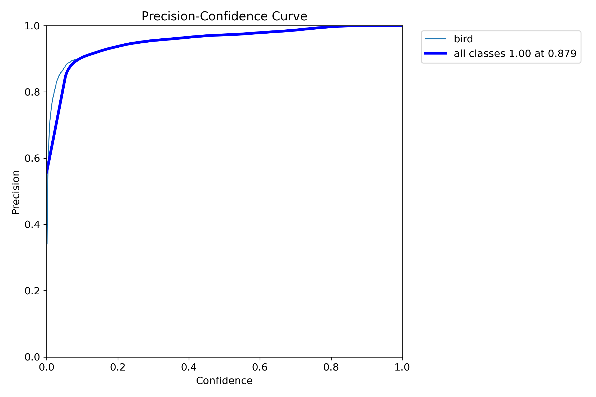
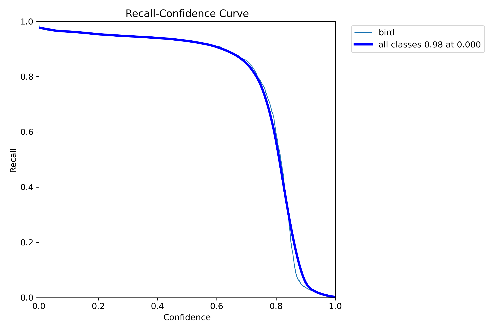

# AI Quantitative Results & Evidence

이 문서는 AEGIS의 **AI·데이터셋·위험 판단 파트에서 사용한 정량 수치, 그래프, confusion matrix, class별 결과와 Runtime gate**를 한곳에 정리한다.

> **표기 원칙:** Custom YOLOv8s 수치는 `Held-Out Offline Test` 결과이며, 공항·야외 live field accuracy로 표현하지 않는다. 현재 안정 Runtime은 **YOLO26n bird detection + ResNet-18 8-class classification** 조합이다.

---

## 1. AI 모델 운용 정책

| 구분 | 모델 | 역할 | 공개 시 주장 범위 |
|---|---|---|---|
| Live Detector | YOLO26n / COCO bird class 14 | bird bbox·center 검출, Stereo 3D 입력 | 실시간 Runtime 구성 |
| Research Detector | Custom YOLOv8s | bird-specific detector 학습·정량 평가 | Held-Out Offline Test |
| Live Classifier | ResNet-18 | YOLO crop 기반 8개 조류군 분류 | Final test + Runtime gate |
| Decision | Explainable Risk Engine | 거리·접근·상대고도·조류군·track evidence 결합 | Prototype decision support |

```text
Frame
→ YOLO bird bbox / center
→ Detection2D
→ Multi-Camera 3D / Track3D
→ object crop
→ ResNet-18 classification
→ confidence gate + temporal vote
→ risk score + recommended response
```

---

## 2. 데이터셋 규모와 정제 결과

| 항목 | 값 |
|---|---:|
| 원천 작업 아카이브 | 약 **13 GB** |
| 원천 파일 수 | **156,416 files** |
| 원천 폴더 수 | **33 folders** |
| 학습 후보 이미지 | 약 **40K images** |
| class-wise 유효 paired source | **13,170 images** |
| Raspberry Pi 실환경 background / negative | **518 images** |
| final prepared YOLO v2 | **12,819 images** |
| YOLO held-out test | **1,325 images / 1,436 bird instances / 67 backgrounds** |
| ResNet final test support | **1,375 crops** |

### Class-wise valid source pool

| Class / Group | Valid pairs |
|---|---:|
| crow | 1,674 |
| duck | 1,588 |
| egret | 2,125 |
| gull | 2,288 |
| pigeon | 1,294 |
| raptor | 1,481 |
| sparrow | 1,379 |
| swallow | 1,341 |
| **Total** | **13,170** |

<p align="center"></p>

정제 과정은 image/label pairing, 클래스별 후보 검수, missing-label audit, 중복·흐림·저해상도·비조류·오라벨 제외, Raspberry Pi field-background hard negative 통합, train/validation/test 분리 순서로 수행했다.

---

## 3. Custom YOLOv8s 정량 결과

### Held-Out Offline Test

| Metric | Result |
|---|---:|
| Precision | **96.4%** |
| Recall | **93.5%** |
| mAP@0.5 | **97.5%** |
| mAP@0.5:0.95 | **70.9%** |

| Final Training Curves | Normalized Confusion Matrix |
|---|---|
|  |  |

| F1–Confidence | Precision–Confidence | Recall–Confidence |
|---|---|---|
|  |  |  |

### 결과 해석

- 높은 offline mAP은 정제한 bird dataset에서 detector가 bird localization을 안정적으로 학습했음을 보여준다.
- `mAP@0.5:0.95`는 IoU 기준이 엄격해질 때의 localization 품질까지 포함하므로 `mAP@0.5`보다 낮다.
- Raspberry Pi 실환경 배경에서는 domain-shift false positive가 확인되어, Custom YOLO는 연구 결과로 분리하고 현재 live detector는 YOLO26n bird class를 사용한다.
- 향후 개선은 **공항·야외 hard-negative mining → field fine-tuning → 거리·bbox 크기별 검출률 평가** 순서로 진행한다.

---

## 4. ResNet-18 8-class 조류군 분류

### Aggregate Result

| Metric | Result |
|---|---:|
| Test Accuracy | **94.76%** |
| Test Macro-F1 | **94.56%** |
| Best Validation Accuracy | **95.52%** |
| Best Validation Macro-F1 | **95.20%** |
| Best Epoch | **7** |
| Test Support | **1,375** |

<p align="center"></p>

### Class-wise Test Report

| Class / Group | Precision | Recall | F1-score | Support |
|---|---:|---:|---:|---:|
| crow | 91.10% | 99.43% | 95.08% | 175 |
| duck | 96.95% | 92.98% | 94.93% | 171 |
| egret | 94.82% | 97.34% | 96.06% | 188 |
| gull | 95.10% | 94.33% | 94.72% | 247 |
| pigeon | 96.20% | 93.16% | 94.65% | 190 |
| raptor | 94.44% | 87.74% | 90.97% | 155 |
| sparrow | 95.91% | 98.80% | 97.33% | 166 |
| swallow | 92.77% | 92.77% | 92.77% | 83 |
| **Macro average** | **94.66%** | **94.57%** | **94.56%** | **1,375** |
| **Weighted average** | **94.82%** | **94.76%** | **94.74%** | **1,375** |

### 결과 해석

- Sparrow는 가장 높은 class F1인 **97.33%**를 기록했다.
- Crow는 recall **99.43%**로 누락이 적었지만 precision은 91.10%로 상대적으로 낮아 유사 조류 오분류를 추가 분석할 필요가 있다.
- Raptor는 recall **87.74%**로 8개 조류군 중 가장 낮아, 다양한 맹금류 외형과 원거리 crop을 보강해야 한다.
- `raptor`는 단일 생물학적 종이 아니라 조류군이므로 문서에서는 **8-class bird classification / 8개 조류군 분류**라고 표현한다.

---

## 5. Runtime Classification Gate

| Gate | Value | 목적 |
|---|---:|---|
| Minimum crop side | **48 px** | 지나치게 작은 crop 차단 |
| Top-1 confidence | **≥ 0.70** | 낮은 신뢰도 예측 차단 |
| Top1–Top2 margin | **≥ 0.15** | 클래스 간 모호성 차단 |
| Vote window | **recent 7** | 단일 프레임 오분류 억제 |
| Stable requirement | **5 votes** | track-level label 확정 |
| Stale reset | **1.2 s** | 오래된 vote 제거 |
| Gate failure | `UNKNOWN` | 분류 실패가 3D tracking을 중단하지 않도록 처리 |

즉, raw Top-1 prediction을 바로 대응 로직에 사용하지 않고 **crop quality → confidence → margin → temporal vote**를 통과한 stable label만 활용한다.

---

## 6. Explainable Risk Score

현재 공개 Runtime의 Decision Engine은 다음 가중합을 사용한다.

| Factor | Weight | 입력 의미 |
|---|---:|---|
| DistanceRisk | 30 | critical distance에 대한 상대 거리 |
| ApproachState | 20 | approaching / crossing / leaving |
| RelativeAltitude | 10 | 상대 저고도·고고도 구간 |
| SpeciesPriority | 15 | 조류군별 prototype priority |
| TrackState | 10 | LOCKED / CRITICAL 등 추적 상태 |
| FusionThreat | 15 | Fusion 단계의 threat evidence |
| **Total** | **100** | Risk Score 0–100 |

| Score | Level |
|---:|---|
| 0–29 | LOW |
| 30–54 | MEDIUM |
| 55–74 | HIGH |
| 75–100 | CRITICAL |

이 Risk Engine은 별도 neural network가 아니라 **Explainable Risk Assessment / Decision Support Algorithm**이다. PPT의 generic equation에 포함된 `GroupRisk`는 개념 항목이며, 현재 공개 Runtime은 별도의 군집 수 feature 대신 species/group identity, track state와 Fusion threat evidence를 결합한다.

---

## 7. AI Decision Console Evidence

| Pigeon Result | Crow Result |
|---|---|
|  |  |

Console은 live crop, raw/stable class, confidence, vote, X/Y/Z, forward range, relative altitude, motion state, risk score, risk level, recommended response를 한 화면에서 연결한다.

---

## 8. Evidence Files

```text
results/yolo/training_curves.png
results/yolo/confusion_matrix.png
results/yolo/confusion_matrix_normalized.png
results/yolo/box_f1_curve.png
results/yolo/box_precision_curve.png
results/yolo/box_recall_curve.png
results/yolo/results.csv

results/resnet/confusion_matrix.png
results/resnet/history.csv
results/resnet/test_summary.json

assets/dataset/dataset_candidate_review.png
assets/ai_console/pigeon_result.png
assets/ai_console/crow_result.png
```

원시 학습 데이터 전체는 용량과 source-management 제약으로 GitHub에 올리지 않고, 재현 코드·정제 규칙·요약 수치·최종 결과 그래프를 공개한다.
