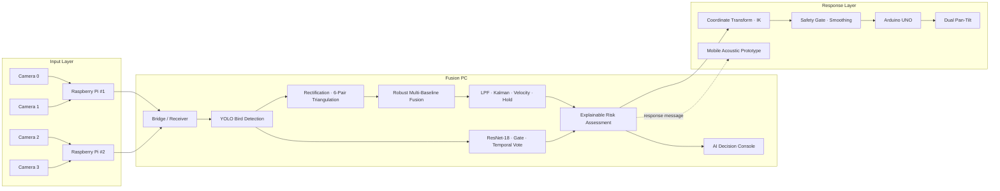

# AEGIS System Architecture

## 1. End-to-End Pipeline



## 2. Explicit Data Interfaces

```text
FramePacket
→ Detection2D
→ StereoPairEstimate
→ Track3D
→ ClassificationResult
→ DecisionResult
→ TurretTarget
→ ArduinoCommand
```

이 interface 분리는 camera transport, AI model, geometry, UI, actuator를 독립적으로 교체·검증할 수 있게 한다.

## 3. Module Responsibilities

| Layer | Responsibility | Main implementation |
|---|---|---|
| Capture | IMX219 dual stream, logical ID, timestamp, JPEG | `runtime/raspberry_pi/` |
| Bridge | RAW TCP reception and Fusion packet conversion | `runtime/fusion_pc/tcp_zmq_bridge.py` |
| Detection | bird bbox/center and Detection2D | `5_final_fusion_async.py` |
| Camera Geometry | rectification, six-pair triangulation, pair validity | `5_final_fusion_async.py`, `runtime/fusion_pc/tools/` |
| Multi-Pair Fusion | timing/reliability weighting and outlier handling | `5_final_fusion_async.py` |
| Tracking | LPF, Kalman, velocity, temporary hold/drop | `5_final_fusion_async.py` |
| Classification | ResNet-18, crop gate, confidence margin, temporal vote | `aegis_species_classifier.py` |
| Decision | species·XYZ·motion·track evidence → score/response | `aegis_decision_engine.py` |
| Interface | crop, class, XYZ, motion, risk, response | `ai_decision_dashboard.py` |
| Turret Control | coordinate transform, IK, safety, serial | `6_turret_server.py`, `calibration_turret.py` |
| Firmware | latest-command parser, servo/laser watchdog | `firmware/arduino_uno/` |

## 4. Camera Geometry

Four cameras create six combinations:

```text
01 · 02 · 03 · 12 · 13 · 23
```

Measured adjacent spacings:

```text
0–1 = 149 mm
1–2 = 151 mm
2–3 = 149 mm
outer 0–3 ≈ 449 mm
```

The runtime uses calibration `T` vectors as authoritative geometry. `01/12/23` form the minimum connected chain; every additional valid pair can contribute a depth estimate. Short baselines preserve overlap for nearby targets, while long baselines improve depth sensitivity.

## 5. Tracking and Control Continuity

- invalid or stale pair estimates are rejected or down-weighted
- track state is filtered rather than recreated from each frame
- temporary detection loss enters hold/coast instead of immediate reset
- ResNet `UNKNOWN` does not stop Track3D
- turret output is generated only after geometry, tracking and safety checks

## 6. Runtime Model Policy

- Live detector: **YOLO26n / COCO bird class 14**
- Live classifier: **ResNet-18 / 8 bird classes-groups**
- Research detector: **custom YOLOv8s / Held-Out Offline Test**
- Risk Engine: **explainable rule-based decision support**, not a separate neural model

## 7. Detailed Design Links

- [Hardware & CAD](HARDWARE_AND_CAD.md)
- [Camera Calibration](CAMERA_CALIBRATION.md)
- [Turret Calibration](TURRET_CALIBRATION.md)
- [AI Pipeline](AI_PIPELINE.md)
- [Protocols](PROTOCOLS.md)
- [Validation & Robustness](VALIDATION_AND_ROBUSTNESS.md)
