# AEGIS System Architecture

## 1. Canonical End-to-End Pipeline

```mermaid
flowchart LR
    subgraph INPUT["Distributed Camera Edge"]
        C0["Camera 0"] --> R1["Raspberry Pi #1"]
        C1["Camera 1"] --> R1
        C2["Camera 2"] --> R2["Raspberry Pi #2"]
        C3["Camera 3"] --> R2
    end

    R1 -->|"ZMQ/JPEG · img0/img1"| RX["Fusion Video Input :5555"]
    R2 -->|"ZMQ/JPEG · img2/img3"| RX

    subgraph FUSION["Fusion PC"]
        DET["HSV / YOLO Detection"]
        GEO["Rectification / 6-Pair Triangulation"]
        MF["Robust Multi-Baseline Fusion"]
        TRK["LPF / Kalman / Velocity / Hold"]
        RX --> DET --> GEO --> MF --> TRK
    end

    subgraph RESPONSE["Response Layer"]
        IK["Coordinate Transform / IK"]
        COMP["Measured Override / Direction Compensation"]
        SAFE["Adaptive Smoothing / Safety Gate"]
        UNO["Arduino UNO"]
        PT["Dual Pan-Tilt"]
        IK --> COMP --> SAFE --> UNO --> PT
    end

    subgraph SUPPORT["Parallel Decision-Support Layer"]
        CLS["ResNet-18 / Gate / Temporal Vote"]
        DEC["Explainable Risk Assessment"]
        UI["AI Decision Console"]
        MOBILE["Mobile Acoustic Prototype"]
        CLS --> DEC --> UI
        DEC -.->|"recommendation only"| MOBILE
    end

    TRK -->|"Track3D target/result :5556"| IK
    TRK -->|"dashboard snapshot :5557"| CLS
```



The Full 4CH configuration uses two Raspberry Pis and four cameras. Both Pi nodes send direct ZMQ/JPEG packets to the Fusion PC over a mutually reachable IPv4 LAN. Wired LAN is recommended for sustained demonstrations; same-subnet Wi-Fi uses the same transport contract. The `tcp_zmq_bridge.py` path is reserved for the simplified 1-RPi / 2-camera RAW-TCP demo.

The actuator and decision-support paths branch after Fusion tracking. The turret server subscribes directly to Track3D target/result packets on `:5556`; the Console uses a separate `:5557` snapshot for ResNet classification and risk display. Console output does not gate turret motion. Fusion reserves `:5558` as command input, but the current dashboard is read-only and does not publish commands.

## 2. Explicit Data Interfaces

```text
Control: FramePacket → Detection2D → StereoPairEstimate → Track3D
                     → TurretTarget (:5556) → ArduinoCommand

Parallel support: dashboard snapshot (:5557) → ClassificationResult
                                            → DecisionResult → AI Console

Reserved: external command client → Fusion (:5558)
          (not used by the current read-only dashboard)
```

This separation lets capture, AI, geometry, UI and actuator modules be tested independently.

## 3. Runtime Mode Mapping

| Mode | Capture | Receiver | Main Geometry |
|---|---|---|---|
| Full 4CH | `sender_FIXED_2.py` + `sender2_FIXED_2.py` | Fusion direct ZMQ `:5555` | up to 6 stereo pairs |
| Simplified 2CH | `sender_TCP_5560.py` | `tcp_zmq_bridge.py` → Fusion | pair `01` centered |
| Calibration | two full senders with `--profile calibration` | calibration capture tools | 4 intrinsics + 6 pairs |

## 4. Module Responsibilities

| Layer | Responsibility | Main implementation |
|---|---|---|
| 4CH Capture | IMX219 dual stream, logical ID, timestamps, JPEG | `runtime/raspberry_pi/sender_FIXED_2.py`, `sender2_FIXED_2.py` |
| 2CH Demo Bridge | RAW TCP receive and local ZMQ conversion | `runtime/fusion_pc/tcp_zmq_bridge.py` |
| Detection | HSV calibration target or YOLO bird bbox/center | `5_final_fusion_async.py` |
| Camera Geometry | rectification, six-pair triangulation, pair validity | `5_final_fusion_async.py`, `runtime/fusion_pc/tools/` |
| Multi-Pair Fusion | synchronization/reliability weighting and outlier handling | `5_final_fusion_async.py` |
| Tracking | LPF, Kalman, velocity, temporary hold/drop | `5_final_fusion_async.py` |
| Track3D Publish | target/result → direct turret `:5556`; dashboard snapshot → `:5557` | `5_final_fusion_async.py` |
| Classification | dashboard crop, ResNet-18 gate, confidence margin, temporal vote | `aegis_species_classifier.py` |
| Decision Support | species·XYZ·motion·track evidence → score/recommendation | `aegis_decision_engine.py` |
| Read-only Interface | subscribe `:5557`; display crop, class, XYZ, motion, risk, response | `ai_decision_dashboard.py` |
| Turret Control | subscribe `:5556`; coordinate transform, IK, measured override, direction compensation, smoothing, safety, serial | `6_turret_server.py`, `calibration_turret.py` |
| Firmware | latest-command parser, servo/laser watchdog | `firmware/arduino_uno/` |

## 5. Camera Geometry

Four cameras create six combinations:

```text
01 · 02 · 03 · 12 · 13 · 23
```

Measured adjacent spacings:

```text
0–1 = 149 mm
1–2 = 151 mm
2–3 = 149 mm
outer 0–3 ≈ 449 mm
```

Calibration `T` vectors are authoritative. `01/12/23` form the minimum connected chain; `02/03/13` provide redundancy and longer-baseline depth sensitivity.

## 6. Tracking and Control Continuity

- stale/invalid pair estimates are rejected or down-weighted
- track state persists across frames
- temporary loss enters hold/coast
- ResNet `UNKNOWN` does not stop Track3D
- turret output is driven directly by valid Track3D on `:5556` and requires geometry, tracking and safety checks
- ResNet/risk/Console runs in parallel on `:5557` and does not gate actuator commands
- `:5558` is reserved Fusion command input; the current dashboard does not send to it
- static turret geometry calibration and dynamic servo-hysteresis compensation are separated
- top-to-bottom tilt motion uses the final field-tuned `0.80°` correction on PT1/PT2
- Full 4CH and simplified demo converge on the same downstream `FramePacket` contract

## 7. Runtime Model Policy

- Live detector: **YOLO26n / COCO bird class 14**
- Calibration/debug detector: **HSV / controlled blue target**
- Live classifier: **ResNet-18 / 8 bird classes-groups**
- Research detector: **custom YOLOv8s / Held-Out Offline Test**
- Risk Engine: **explainable rule-based decision support**

## 8. Detailed Links

- [Runtime Modes](RUNTIME_MODES.md)
- [Hardware & CAD](HARDWARE_AND_CAD.md)
- [Camera Calibration](CAMERA_CALIBRATION.md)
- [Turret Calibration](TURRET_CALIBRATION.md)
- [AI Pipeline](AI_PIPELINE.md)
- [Protocols](PROTOCOLS.md)
- [Validation & Robustness](VALIDATION_AND_ROBUSTNESS.md)
