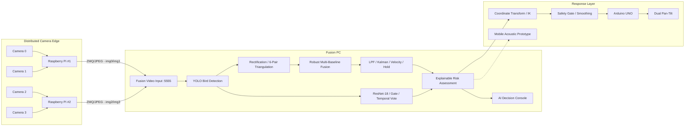

# AEGIS System Architecture

## 1. Canonical End-to-End Pipeline



The Full 4CH configuration uses two Raspberry Pis and four cameras. The `tcp_zmq_bridge.py` path is reserved for the simplified 1-RPi / 2-camera RAW-TCP demo.

## 2. Explicit Data Interfaces

```text
FramePacket
→ Detection2D
→ StereoPairEstimate
→ Track3D
→ ClassificationResult
→ DecisionResult
→ TurretTarget
→ ArduinoCommand
```

This separation lets capture, AI, geometry, UI and actuator modules be tested independently.

## 3. Runtime Mode Mapping

| Mode | Capture | Receiver | Main Geometry |
|---|---|---|---|
| Full 4CH | `sender_FIXED_2.py` + `sender2_FIXED_2.py` | Fusion direct ZMQ `:5555` | up to 6 stereo pairs |
| Simplified 2CH | `sender_TCP_5560.py` | `tcp_zmq_bridge.py` → Fusion | pair `01` centered |
| Calibration | two full senders with `--profile calibration` | calibration capture tools | 4 intrinsics + 6 pairs |

## 4. Module Responsibilities

| Layer | Responsibility | Main implementation |
|---|---|---|
| 4CH Capture | IMX219 dual stream, logical ID, timestamps, JPEG | `runtime/raspberry_pi/sender_FIXED_2.py`, `sender2_FIXED_2.py` |
| 2CH Demo Bridge | RAW TCP receive and local ZMQ conversion | `runtime/fusion_pc/tcp_zmq_bridge.py` |
| Detection | bird bbox/center and `Detection2D` | `5_final_fusion_async.py` |
| Camera Geometry | rectification, six-pair triangulation, pair validity | `5_final_fusion_async.py`, `runtime/fusion_pc/tools/` |
| Multi-Pair Fusion | synchronization/reliability weighting and outlier handling | `5_final_fusion_async.py` |
| Tracking | LPF, Kalman, velocity, temporary hold/drop | `5_final_fusion_async.py` |
| Classification | ResNet-18, crop gate, confidence margin, temporal vote | `aegis_species_classifier.py` |
| Decision | species·XYZ·motion·track evidence → score/response | `aegis_decision_engine.py` |
| Interface | crop, class, XYZ, motion, risk, response | `ai_decision_dashboard.py` |
| Turret Control | coordinate transform, IK, safety, serial | `6_turret_server.py`, `calibration_turret.py` |
| Firmware | latest-command parser, servo/laser watchdog | `firmware/arduino_uno/` |

## 5. Camera Geometry

Four cameras create six combinations:

```text
01 · 02 · 03 · 12 · 13 · 23
```

Measured adjacent spacings:

```text
0–1 = 149 mm
1–2 = 151 mm
2–3 = 149 mm
outer 0–3 ≈ 449 mm
```

Calibration `T` vectors are authoritative. `01/12/23` form the minimum connected chain; `02/03/13` provide redundancy and longer-baseline depth sensitivity.

## 6. Tracking and Control Continuity

- stale/invalid pair estimates are rejected or down-weighted
- track state persists across frames
- temporary loss enters hold/coast
- ResNet `UNKNOWN` does not stop Track3D
- turret output requires geometry, tracking and safety checks
- Full 4CH and simplified demo converge on the same downstream `FramePacket` contract

## 7. Runtime Model Policy

- Live detector: **YOLO26n / COCO bird class 14**
- Live classifier: **ResNet-18 / 8 bird classes-groups**
- Research detector: **custom YOLOv8s / Held-Out Offline Test**
- Risk Engine: **explainable rule-based decision support**

## 8. Detailed Links

- [Runtime Modes](RUNTIME_MODES.md)
- [Hardware & CAD](HARDWARE_AND_CAD.md)
- [Camera Calibration](CAMERA_CALIBRATION.md)
- [Turret Calibration](TURRET_CALIBRATION.md)
- [AI Pipeline](AI_PIPELINE.md)
- [Protocols](PROTOCOLS.md)
- [Validation & Robustness](VALIDATION_AND_ROBUSTNESS.md)
