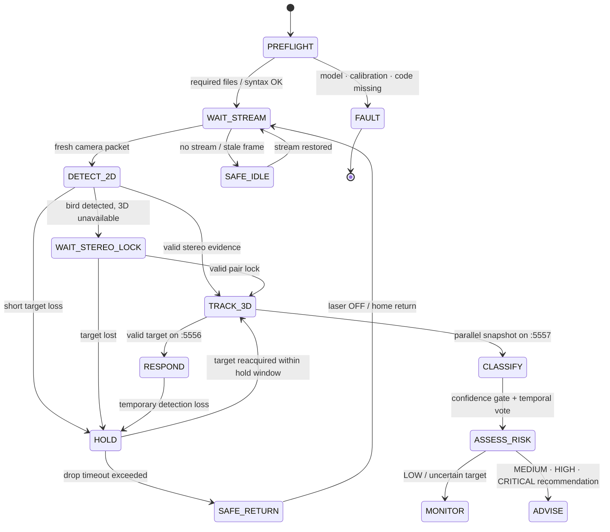

# AEGIS Operational Flow & Runtime States

이 문서는 AEGIS가 실제로 실행될 때 **영상 입력부터 물리 대응까지 어떤 단계와 안전 조건을 거치는지** 설명한다.

아래 상태명은 하나의 거대한 `enum`을 그대로 옮긴 것이 아니라, Fusion·AI·Turret 모듈에 분산된 실제 동작을 심사와 재현 관점에서 묶은 **운용 상태 모델**이다.

---

## 1. End-to-End Scenario

1. **BOOT / PREFLIGHT**  
   실행 파일, YOLO·ResNet weight, 필수 calibration NPZ의 존재와 Python syntax를 점검한다.
2. **WAIT_STREAM**  
   Raspberry Pi sender가 IMX219 영상을 전송하고 Fusion PC가 최신 frame packet을 기다린다.
3. **DETECT_2D**  
   YOLO가 각 카메라 영상에서 bird bounding box와 중심점을 생성한다. HSV는 기하·통신 baseline 및 turret calibration 검증 모드로 유지된다.
4. **WAIT_STEREO_LOCK**  
   2D target은 있으나 유효한 stereo pair가 부족하면 물리 대응을 시작하지 않고 3D lock을 기다린다.
5. **TRACK_3D**  
   최대 6개 stereo pair의 triangulation 결과를 품질·baseline·동기화 조건으로 가중 결합하고, Kalman/LPF/velocity/hold를 적용한다.
6. **PUBLISH CONTROL TARGET**  
   Fusion이 유효 Track3D target/result를 `:5556`으로 직접 publish한다. Turret Server는 AI Console의 분류·위험도 결과를 기다리지 않는다.
7. **CLASSIFY / VOTE / ASSESS_RISK — PARALLEL SUPPORT**  
   별도 `:5557` snapshot 경로가 ResNet-18과 temporal voting을 수행하고 Risk Score·권장 대응을 AI Console에 표시한다.
8. **RESPOND / HOLD / SAFE RETURN**  
   Turret Server가 `:5556` target에 measured IK와 방향성 backlash 보상을 적용한다. 짧은 유실은 hold, 장기 유실은 laser OFF와 home 복귀로 처리한다. 현재 Console은 read-only이며 reserved `:5558` 입력으로 명령을 보내지 않는다.

---

## 2. Runtime State Diagram



---

## 3. State Inputs, Outputs, and Guards

| Operational state | Primary input | Output | Main guard / fallback |
|---|---|---|---|
| `PREFLIGHT` | code, model, calibration files | pass/fail | 필수 파일 누락 또는 syntax 오류 시 실행 중단 |
| `WAIT_STREAM` | Pi packet | fresh frame set | stale packet은 사용하지 않음 |
| `DETECT_2D` | camera image | bbox, center, confidence | class/area/confidence 및 center-jump 조건 |
| `WAIT_STEREO_LOCK` | multi-view detections | monitoring state | 3D lock 전 actuator 명령 억제 |
| `TRACK_3D` | stereo pairs | filtered XYZ, velocity, threat | sync window, rectified-Y, position/speed gate |
| `CLASSIFY` | parallel `:5557` dashboard crop | raw/stable class | min crop 48 px, confidence 0.70, margin 0.15 |
| `ASSESS_RISK` | `:5557` class, XYZ, prediction, track | score, level, recommendation | UNKNOWN은 보수적 monitoring recommendation으로 fallback |
| `RESPOND` | direct `:5556` Track3D target packet | dual pan/tilt command | measured IK, direction compensation, safe angles, distance gate, spike clamp, watchdog |
| `HOLD` | last valid track | short coast | Fusion hold 0.30 s, aim hold 0.20 s |
| `SAFE_RETURN` | stale/drop event | laser OFF, home return | drop 1.00 s 이후 점진 복귀 |

---

## 4. Detection and 3D Guards

### 2D Detection

- Runtime 기본 mode: `YOLO`
- Runtime model: `models/yolo26n.pt`
- COCO bird class: `14`
- max detection: `1`
- minimum box area: `80 px²`
- bbox center smoothing alpha: `0.75`
- maximum center jump: `220 px`
- HSV `Target_1`은 blue table-tennis ball calibration/debug target으로 사용 가능

### Multi-Camera Fusion

- required chain pairs: `01`, `12`, `23`
- additional loadable pairs: `02`, `03`, `13`
- pair sync hard window: `0.06 s`
- pair sync soft window: `0.09 s`
- maximum frame age: `0.25 s`
- maximum target speed gate: `3.5 m/s`
- critical distance reference: `1.5 m`
- maximum laser distance: `2.2 m`

Calibration resolution은 `1280×720`, low-latency runtime은 `640×360`이며, 2D detection 좌표를 calibration 좌표계로 재스케일한 뒤 triangulation한다.

---

## 5. Species Classification State

```text
crop available
→ min side ≥ 48 px
→ ResNet-18 softmax
→ Top-1 confidence ≥ 0.70
→ Top1–Top2 margin ≥ 0.15
→ recent 7 votes 중 5 votes 확보
→ stable species/group
```

조건을 충족하지 못하면 `UNKNOWN`으로 처리한다. 이 분류와 Risk Engine은 `:5557` 병렬 지원 경로에 있으므로 분류 실패가 3D tracking이나 `:5556` 터렛 제어를 중단시키지 않는다. Risk Engine은 보수적인 monitoring/track recommendation을 반환한다.

---

## 6. Risk and Response States

| Factor | Weight |
|---|---:|
| Distance risk | 30 |
| Approach state | 20 |
| Relative altitude | 10 |
| Species priority | 15 |
| Track state | 10 |
| Fusion threat | 15 |

| Risk level | Condition | Typical recommendation |
|---|---|---|
| `LOW` | score < 30 | `MONITOR` |
| `MEDIUM` | 30–54 | `TURRET TRACK / ACOUSTIC READY` |
| `HIGH` | 55–74 | turret tracking + acoustic response |
| `CRITICAL` | score ≥ 75 or Fusion status critical | turret + response escalation |

이 결과는 공항 인증 자동 명령이 아니라 **설명 가능한 prototype decision support**다. 현재 결과는 Console에 표시되며 터렛의 `:5556` packet을 생성하거나 차단하지 않는다.

---

## 7. Turret Safety & Control State

터렛 서버는 Fusion Track3D가 `:5556`으로 직접 보낸 target packet을 받는다. 이 경로는 `:5557` AI Console/ResNet/Risk 경로와 병렬이며, 받은 packet도 바로 servo 출력으로 전달하지 않는다.

```text
valid dictionary
→ aim flag
→ status not IDLE/DROPPED
→ finite XYZ
→ inverse kinematics
→ measured geometry/trim/axis override
→ direction-aware tilt backlash compensation
→ spike clamp
→ adaptive EMA + pan/tilt deadband
→ pan/tilt safe-angle clamp
→ latest serial command write
```

Current field-tuned control:

- PT1 downward tilt compensation: `0.80°`
- PT2 downward tilt compensation: `0.80°`
- upward compensation: `0.00°`
- base / max alpha: `0.40 / 0.90`
- pan / tilt deadband: `0.08° / 0.10°`
- servo minimum send interval: `0.020 s`
- maximum angle step: `18°/frame`
- downward response multiplier: `1.18`

추가 안전 조건:

- pan: `20°–160°`
- tilt: `45°–150°`
- ZMQ `CONFLATE=1`로 최신 target만 유지
- serial 전송 전 오래된 PC output buffer 제거
- target short-loss 시 laser OFF hold
- long-loss 시 home return
- Arduino command watchdog에 맞춘 laser keepalive

---

## 8. Main Code Mapping

| Phase | Main implementation |
|---|---|
| Preflight | `runtime/fusion_pc/demo_preflight.ps1` |
| Pi capture/transport | `runtime/raspberry_pi/sender_FIXED_2.py`, `sender2_FIXED_2.py`; `sender_TCP_5560.py` is demo-only |
| TCP→ZMQ bridge | `runtime/fusion_pc/tcp_zmq_bridge.py` — simplified 2CH only |
| Detection/3D/tracking | `runtime/fusion_pc/5_final_fusion_async.py` |
| Track3D control publish (`:5556`) | `runtime/fusion_pc/5_final_fusion_async.py` |
| Dashboard snapshot publish (`:5557`) | `runtime/fusion_pc/5_final_fusion_async.py` |
| Species classification | `runtime/fusion_pc/aegis_species_classifier.py` |
| Risk/recommendation | `runtime/fusion_pc/aegis_decision_engine.py` |
| Read-only Decision UI | `runtime/fusion_pc/ai_decision_dashboard.py` |
| Turret control (`:5556` subscriber) | `runtime/fusion_pc/6_turret_server.py` |
| Arduino actuator | `firmware/arduino_uno/turret_uno.ino` |

---

## 9. Demonstration Interpretation

시연에서는 다음 네 장면이 한 흐름으로 연결되어야 한다.

1. 실물 target이 camera field에 들어온다.
2. Fusion 화면에서 bbox·XYZ·track이 갱신된다.
3. 병렬 `:5557` 경로의 AI Console에서 조류군·confidence·Risk·Recommended Response가 갱신된다.
4. `:5556`을 직접 구독하는 Dual Pan-Tilt가 유효 target을 추적하고 target loss 시 안전 상태로 전환한다.

즉 실제 런타임은 **Perception → Localization → Tracking 이후 직접 Turret 제어와 AI Decision Support 표시가 병렬로 동작**한다. Recommended Response는 운용자 지원 정보이며 현재 터렛 명령의 선행 조건이 아니다.
