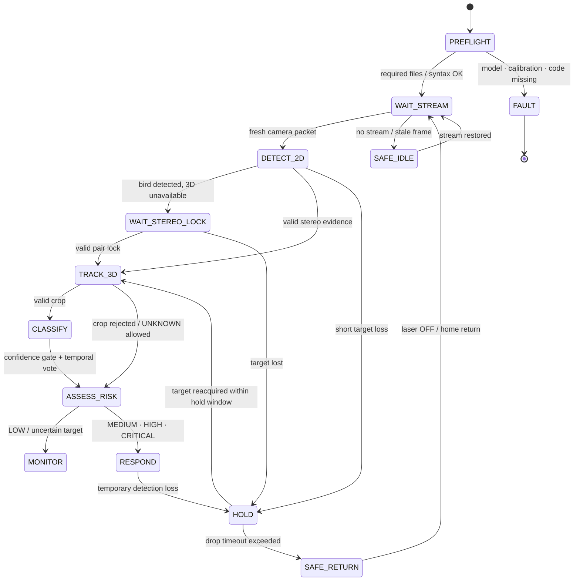

# AEGIS Operational Flow & Runtime States

이 문서는 AEGIS가 실제로 실행될 때 **영상 입력부터 물리 대응까지 어떤 단계와 안전 조건을 거치는지** 설명한다.

아래 상태명은 하나의 거대한 `enum`을 그대로 옮긴 것이 아니라, Fusion·AI·Turret 모듈에 분산된 실제 동작을 심사와 재현 관점에서 묶은 **운용 상태 모델**이다.

---

## 1. End-to-End Scenario

1. **BOOT / PREFLIGHT**  
   실행 파일, YOLO·ResNet weight, 필수 calibration NPZ의 존재와 Python syntax를 점검한다.
2. **WAIT_STREAM**  
   Raspberry Pi sender가 IMX219 영상을 전송하고 Fusion PC가 최신 frame packet을 기다린다.
3. **DETECT_2D**  
   YOLO가 각 카메라 영상에서 bird bounding box와 중심점을 생성한다. HSV는 기하·통신 baseline 검증 모드로 유지된다.
4. **WAIT_STEREO_LOCK**  
   2D target은 있으나 유효한 stereo pair가 부족하면 물리 대응을 시작하지 않고 3D lock을 기다린다.
5. **TRACK_3D**  
   최대 6개 stereo pair의 triangulation 결과를 품질·baseline·동기화 조건으로 가중 결합하고, Kalman/LPF/velocity/hold를 적용한다.
6. **CLASSIFY / VOTE**  
   유효 crop에 ResNet-18을 적용하고 confidence·Top1–Top2 margin·5-of-7 temporal voting으로 안정 조류군을 결정한다.
7. **ASSESS_RISK**  
   거리, 접근 상태, 상대고도, 조류군 우선도, track 상태, Fusion threat를 결합해 Risk Score와 권장 대응을 생성한다.
8. **RESPOND / HOLD / SAFE RETURN**  
   유효 target만 터렛 서버로 전달하며, 짧은 유실은 hold, 장기 유실은 laser OFF와 점진적 home 복귀로 처리한다.

---

## 2. Runtime State Diagram



---

## 3. State Inputs, Outputs, and Guards

| Operational state | Primary input | Output | Main guard / fallback |
|---|---|---|---|
| `PREFLIGHT` | code, model, calibration files | pass/fail | 필수 파일 누락 또는 syntax 오류 시 실행 중단 |
| `WAIT_STREAM` | Pi packet | fresh frame set | stale packet은 사용하지 않음 |
| `DETECT_2D` | camera image | bbox, center, confidence | class/area/confidence 및 center-jump 조건 |
| `WAIT_STEREO_LOCK` | multi-view detections | monitoring state | 3D lock 전 actuator 명령 억제 |
| `TRACK_3D` | stereo pairs | filtered XYZ, velocity, threat | sync window, rectified-Y, position/speed gate |
| `CLASSIFY` | target crop | raw/stable class | min crop 48 px, confidence 0.70, margin 0.15 |
| `ASSESS_RISK` | class, XYZ, prediction, track | 0–100 score, level, response | UNKNOWN은 보수적 response로 fallback |
| `RESPOND` | valid target packet | dual pan/tilt command | safe angles, distance gate, spike clamp, watchdog |
| `HOLD` | last valid track | short coast | Fusion hold 0.30 s, aim hold 0.20 s |
| `SAFE_RETURN` | stale/drop event | laser OFF, home return | drop 1.00 s 이후 점진 복귀 |

---

## 4. Detection and 3D Guards

### 2D Detection

- Runtime 기본 mode: `YOLO`
- Runtime model: `models/yolo26n.pt`
- COCO bird class: `14`
- max detection: `1`
- minimum box area: `80 px²`
- bbox center smoothing alpha: `0.75`
- maximum center jump: `220 px`

### Multi-Camera Fusion

- required chain pairs: `01`, `12`, `23`
- additional loadable pairs: `02`, `03`, `13`
- pair sync hard window: `0.06 s`
- pair sync soft window: `0.09 s`
- maximum frame age: `0.25 s`
- maximum target speed gate: `3.5 m/s`
- critical distance reference: `1.5 m`
- maximum laser distance: `2.2 m`

Calibration resolution은 `1280×720`, low-latency runtime은 `640×360`이며, 2D detection 좌표를 calibration 좌표계로 재스케일한 뒤 triangulation한다.

---

## 5. Species Classification State

```text
crop available
→ min side ≥ 48 px
→ ResNet-18 softmax
→ Top-1 confidence ≥ 0.70
→ Top1–Top2 margin ≥ 0.15
→ recent 7 votes 중 5 votes 확보
→ stable species/group
```

조건을 충족하지 못하면 `UNKNOWN`으로 처리한다. 분류 실패가 3D tracking 자체를 중단시키지 않도록 설계했으며, Risk Engine은 불확실한 조류군에 대해 보수적인 monitoring/track response를 반환한다.

---

## 6. Risk and Response States

| Factor | Weight |
|---|---:|
| Distance risk | 30 |
| Approach state | 20 |
| Relative altitude | 10 |
| Species priority | 15 |
| Track state | 10 |
| Fusion threat | 15 |

| Risk level | Condition | Typical recommendation |
|---|---|---|
| `LOW` | score < 30 | `MONITOR` |
| `MEDIUM` | 30–54 | `TURRET TRACK / ACOUSTIC READY` |
| `HIGH` | 55–74 | turret tracking + acoustic response |
| `CRITICAL` | score ≥ 75 or Fusion status critical | turret + response escalation |

이 결과는 공항 인증 자동 명령이 아니라 **설명 가능한 prototype decision support**다.

---

## 7. Turret Safety State

터렛 서버는 target packet을 바로 servo 출력으로 전달하지 않는다.

```text
valid dictionary
→ aim flag
→ status not IDLE/DROPPED
→ finite XYZ
→ inverse kinematics
→ pan/tilt safe-angle clamp
→ EMA smoothing
→ per-frame spike clamp
→ serial latest-command write
```

추가 안전 조건:

- pan: `20°–160°`
- tilt: `45°–150°`
- ZMQ `CONFLATE=1`로 최신 target만 유지
- serial 전송 전 오래된 PC output buffer 제거
- target short-loss 시 laser OFF hold
- long-loss 시 home return
- Arduino command watchdog에 맞춘 laser keepalive

---

## 8. Main Code Mapping

| Phase | Main implementation |
|---|---|
| Prefight | `runtime/fusion_pc/demo_preflight.ps1` |
| Pi capture/transport | `runtime/raspberry_pi/sender_TCP_5560.py`, `sender_FIXED_2.py`, `sender2_FIXED_2.py` |
| TCP→ZMQ bridge | `runtime/fusion_pc/tcp_zmq_bridge.py` |
| Detection/3D/tracking | `runtime/fusion_pc/5_final_fusion_async.py` |
| Species classification | `runtime/fusion_pc/aegis_species_classifier.py` |
| Risk/response | `runtime/fusion_pc/aegis_decision_engine.py` |
| Decision UI | `runtime/fusion_pc/ai_decision_dashboard.py` |
| Turret control | `runtime/fusion_pc/6_turret_server.py` |
| Arduino actuator | `firmware/arduino_uno/turret_uno.ino` |

---

## 9. Demonstration Interpretation

시연에서는 다음 네 장면이 한 흐름으로 연결되어야 한다.

1. 실물 target이 camera field에 들어온다.
2. Fusion 화면에서 bbox·XYZ·track이 갱신된다.
3. AI Console에서 조류군·confidence·Risk·Response가 갱신된다.
4. Dual Pan-Tilt가 유효 target을 추적하고, target loss 시 안전 상태로 전환한다.

즉 AEGIS의 시연 단위는 개별 AI 화면이 아니라 **Perception → Localization → Tracking → Decision → Response의 폐루프 전체**다.
