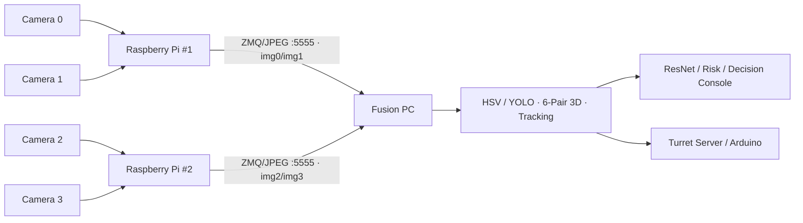
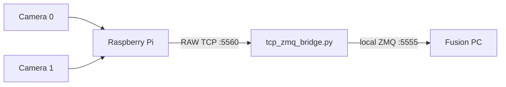

# AEGIS Runtime Modes

AEGIS는 **Full 4CH system**, **Simplified 2CH demo**, **4CH calibration**을 명확히 분리한다.  
대회 보고서와 전체 시스템 주장은 Full 4CH 구성을 기준으로 하며, 2CH demo는 축소 재현 경로다.

## 1. Mode Matrix

| Mode | Camera / Raspberry Pi | Transport | Profile | Main Purpose |
|---|---|---|---|---|
| **Full 4CH AEGIS Runtime** | 4 Camera / **2 RPi** | direct ZMQ/JPEG over IPv4 LAN → Fusion `:5555` | **640×360 @ 30 FPS, Q70** | 6-pair 3D·Tracking·AI·Turret 전체 시스템 |
| **Simplified 2CH Demo** | 2 Camera / 1 RPi | RAW TCP `:5560` → `tcp_zmq_bridge.py` → ZMQ `:5555` | **640×360 @ 20 FPS, Q60** | 축소 시연·백업·빠른 재현 |
| **4CH Calibration** | 4 Camera / 2 RPi | direct ZMQ/JPEG over IPv4 LAN → Fusion `:5555` | **1280×720 @ 20 FPS, Q76** | 4 intrinsics와 6 stereo-pair capture |

Full 4CH transport의 핵심 contract는 **두 RPi가 Fusion PC의 `:5555`로 직접 ZMQ/JPEG를 송신**한다는 점이다. 대회/장시간 시연에서는 안정성을 위해 유선 LAN을 권장하며, 동일 subnet의 Wi-Fi LAN에서도 최종 2-RPi/4CH 통합 동작을 검증했다. 게스트 Wi-Fi처럼 peer/client isolation이 있는 환경에서는 장치 간 TCP 통신이 차단될 수 있으므로 사전 확인이 필요하다.

## 2. Canonical Full 4CH Topology



- RPi #1: `sender_FIXED_2.py`, logical camera `0/1`
- RPi #2: `sender2_FIXED_2.py`, logical camera `2/3`
- Launcher: `scripts/rpi_start_sender.sh`
- Fusion PC full mode: `demo_start_windows.ps1 -Mode full4ch`
- `tcp_zmq_bridge.py`는 Full 4CH에서 사용하지 않는다.
- Both RPi nodes and the Fusion PC must be mutually reachable on the same routable IPv4 LAN.

## 3. Simplified 2CH Demo Topology



- sender: `sender_TCP_5560.py`
- logical camera: `0/1`
- launcher: `scripts/rpi_start_demo_2ch.sh`
- Fusion PC demo mode: `demo_start_windows.ps1 -Mode demo2ch`
- 이 경로는 pair `01` 중심의 축소 데모이며 4CH simultaneous operation을 주장하는 근거로 사용하지 않는다.

## 4. Full 4CH Runtime Commands

Fusion PC:

```powershell
cd runtime\fusion_pc
powershell -ExecutionPolicy Bypass -File .\demo_preflight.ps1 -Mode full4ch
powershell -ExecutionPolicy Bypass -File .\demo_start_windows.ps1 -Mode full4ch
```

RPi #1:

```bash
bash scripts/rpi_start_sender.sh rpi1 <FUSION_PC_IP> runtime
```

RPi #2:

```bash
bash scripts/rpi_start_sender.sh rpi2 <FUSION_PC_IP> runtime
```

## 5. Calibration Commands

RPi #1:

```bash
bash scripts/rpi_start_sender.sh rpi1 <FUSION_PC_IP> calibration
```

RPi #2:

```bash
bash scripts/rpi_start_sender.sh rpi2 <FUSION_PC_IP> calibration
```

Calibration capture는 `1280×720 @ 20 FPS, Q76`을 유지한다. Runtime에서 640×360으로 낮추더라도 2D center를 calibration resolution으로 재스케일한 뒤 triangulation한다.

## 6. Detection / Control Note

- **YOLO**: live bird detection path.
- **HSV**: low-latency baseline, geometric calibration and controlled bench validation path.
- Latest turret bench recalibration used a blue table-tennis ball in HSV mode so that the target center is independent of YOLO bounding-box center bias.
- Turret geometry calibration and runtime direction-dependent servo backlash compensation are separate layers.

## 7. Documentation Rule

다음 표현을 섞지 않는다.

- **Full 4CH**: 2 RPi / 4 Camera / direct ZMQ/JPEG / 30 FPS / Q70
- **Simplified 2CH Demo**: 1 RPi / 2 Camera / RAW TCP bridge / 20 FPS / Q60
- **Calibration**: 2 RPi / 4 Camera / 1280×720 / 20 FPS / Q76

README, PPT, 시연영상, Q&A에서 “현재 기준 시스템”은 Full 4CH이며, 2CH demo는 명시적으로 축소 경로라고 표기한다.
